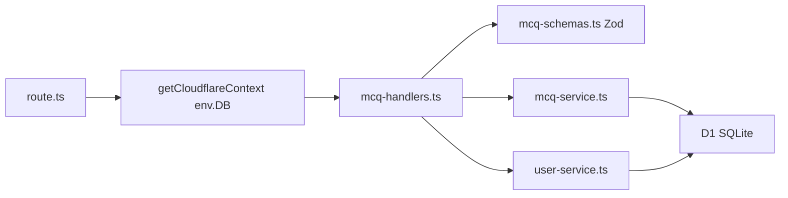

Date created: Aug 31, 2026

Date last modified: Aug 31, 2026 (Phase 4 batches 3–4 deployed)

# MCQ CRUD - Technical PRD

## Implementation Status Summary

| Item | Status |
|------|--------|
| Phase 0 (PRD) | **COMPLETED** |
| Phase 1 (D1 migration + schema tests) | **COMPLETED and verified** |
| Phase 2 (MCQ service) | **COMPLETED and verified** |
| Phase 3 (API routes) | **COMPLETED and verified** |
| Phase 4 (UI pages and components) | **COMPLETED and verified** |
| Phase 5 (Verification) | **PLANNED** |
| Branch | `feature/mcq-crud` @ `8afd837` |
| Production URL | https://es-ai-work.harish-ms.workers.dev |
| Test suite | 16 files, **100 tests** — all passing (Aug 31, 2026) |

**Git commits (traceability):**

| Phase | Commit | Message |
|-------|--------|---------|
| 0 | `6f55b34` | Add Phase 0 MCQ CRUD technical PRD with Phase 1 implementation record. |
| 1 | `46e18af` | Add Phase 1 MCQ D1 migration and schema tests. |
| 2 | `36c3f5a` | Add Phase 2 MCQ service with TDD unit tests. |
| 3 | `4328364` | Add Phase 3 MCQ API handlers, Zod schemas, and route wrappers. |
| 4 | `363ef51` | Add Phase 4 MCQ UI pages, components, and component tests. |
| 4 (enhancements) | `7264655` | Add Phase 4 post-sanity-test MCQ UI enhancements. |
| 4 (UX polish) | `ebbf672` | Add Phase 4 UX polish: Submit label, empty warning, tooltips, delete copy. |
| 4 (batch 3–4) | `8afd837` | Add Phase 4 batch 3–4 MCQ UX refinements after local verification. |

---

## Overview/Problem

Teachers who register and log in to the Quiz Maker currently land on a stub page at `/mcqs` with no way to create or manage multiple-choice questions. Without MCQ CRUD, there is no shared test bank for teachers to build, preview, or maintain quiz content.

This PRD defines the **MCQ create/read/update/delete feature** with choices and attempt tracking, implemented in five phases. **Phase 1 is complete.** Phases 2–5 cover the service layer, API routes, UI, and verification.

---

## Hypothesis

We believe that providing MCQ CRUD with a list table, create/edit forms, interactive preview, and attempt recording will enable teachers to build and validate a shared multiple-choice test bank in the Quiz Maker application.

---

## Scope

### In Scope

What will be built in this feature:

- Cloudflare D1 tables: `mcqs`, `mcq_choices`, `mcq_attempts` (migration `0002_create_mcqs.sql`)
- MCQ service in `src/lib/services/mcq-service.ts` for CRUD, choices, and attempt recording
- HTTP REST API endpoints under `src/app/api/mcqs/` with Zod validation
- Expand `/mcqs` stub into a list page with shadcn table, row actions (Edit, Preview, Delete), and Create button
- Create/edit page at `/mcqs/new` and `/mcqs/[id]/edit` with Save and Cancel
- Interactive preview at `/mcqs/[id]/preview` that records attempts with correct/incorrect result
- Vitest unit tests written test-first in every implementation phase (red → green)
- Technical PRD maintained in this document

### Out of Scope

What is explicitly not being built now but may be considered later:

- Server-side auth / route protection on `/mcqs/*` (client sends `userId` from `localStorage`; not cryptographically verified)
- Displaying creator name in the list table (`created_by_user_id` stored for future use)
- Pagination, search, or filtering on the MCQ list
- Attempt history UI or analytics dashboards
- Role-based access control (who can edit/delete which MCQs)
- Server Actions as the primary mutation path (REST endpoints chosen to match auth pattern)

### Cut

Things that were considered during planning but deliberately removed (and why):

- `description` field on MCQs — Cut in favor of a single `question` field as the MCQ prompt
- `sort_order` on choices — Cut in favor of `position` per schema spec
- Read-only preview — Cut; preview is interactive and records attempts via the attempts API
- Separate `choice_id` column name on attempts — Cut in favor of `mcq_choice_id` per schema spec

---

## Technical Requirements

### Database Schema

The application uses Cloudflare D1 (SQLite). Three new tables extend the existing `users` table from auth.

**Setup steps** (see `.cursor/rules/d1.mdc`):

1. Migration already created: `migrations/0002_create_mcqs.sql`
2. Apply locally only: `npx wrangler d1 migrations apply quizmaker-db --local`
3. Never apply to remote without explicit user approval

```sql
CREATE TABLE mcqs (
  id TEXT PRIMARY KEY DEFAULT (lower(hex(randomblob(16)))),
  name TEXT NOT NULL,
  question TEXT NOT NULL,
  created_by_user_id TEXT NOT NULL REFERENCES users(id) ON DELETE CASCADE,
  created_at DATETIME DEFAULT CURRENT_TIMESTAMP,
  updated_at DATETIME DEFAULT CURRENT_TIMESTAMP
);

CREATE TABLE mcq_choices (
  id TEXT PRIMARY KEY DEFAULT (lower(hex(randomblob(16)))),
  mcq_id TEXT NOT NULL REFERENCES mcqs(id) ON DELETE CASCADE,
  choice_text TEXT NOT NULL,
  is_correct INTEGER NOT NULL DEFAULT 0,
  position INTEGER NOT NULL,
  created_at DATETIME DEFAULT CURRENT_TIMESTAMP,
  updated_at DATETIME DEFAULT CURRENT_TIMESTAMP
);

CREATE TABLE mcq_attempts (
  id TEXT PRIMARY KEY DEFAULT (lower(hex(randomblob(16)))),
  mcq_id TEXT NOT NULL REFERENCES mcqs(id) ON DELETE CASCADE,
  mcq_choice_id TEXT NOT NULL REFERENCES mcq_choices(id) ON DELETE CASCADE,
  user_id TEXT NOT NULL REFERENCES users(id) ON DELETE CASCADE,
  is_correct INTEGER NOT NULL,
  created_at DATETIME DEFAULT CURRENT_TIMESTAMP
);

CREATE INDEX idx_mcqs_created_by_user_id ON mcqs (created_by_user_id);
CREATE INDEX idx_mcq_choices_mcq_id ON mcq_choices (mcq_id);
CREATE INDEX idx_mcq_attempts_mcq_id ON mcq_attempts (mcq_id);
CREATE INDEX idx_mcq_attempts_user_id ON mcq_attempts (user_id);
```

**Column notes:**

| Table | Column | Description |
|-------|--------|-------------|
| `mcqs` | `name` | Short title shown in the list table |
| `mcqs` | `question` | Full MCQ prompt shown in preview and edit form |
| `mcqs` | `created_by_user_id` | FK to `users.id`; set on create only |
| `mcq_choices` | `position` | Display order (1-based in UI) |
| `mcq_choices` | `is_correct` | 0 or 1; exactly one choice per MCQ must be correct |
| `mcq_attempts` | `mcq_choice_id` | Selected choice FK |
| `mcq_attempts` | `user_id` | Who submitted the preview attempt |
| `mcq_attempts` | `is_correct` | Whether the selected choice was correct |

### API Endpoints

All endpoints are route handlers under `src/app/api/mcqs/`. Request bodies validated with Zod. Handler logic in `src/lib/services/mcq-handlers.ts`; route files delegate after obtaining `env.DB` via `getCloudflareContext()`. MCQ service (`src/lib/services/mcq-service.ts`) handles all D1 access.

#### GET /api/mcqs

Lists all MCQs ordered by `updated_at DESC`.

**Response:**

- Success (200): `{ "success": true, "mcqs": [{ "id", "name", "question", "createdByUserId", "createdAt", "updatedAt" }] }`
- Error (500): `{ "success": false, "error": "Internal server error" }`

#### POST /api/mcqs

Creates a new MCQ with choices.

**Request Body:**

```json
{
  "name": "Photosynthesis Basics",
  "question": "Which organelle performs photosynthesis?",
  "createdByUserId": "<user-id-from-localStorage>",
  "choices": [
    { "text": "Mitochondria", "isCorrect": false },
    { "text": "Chloroplast", "isCorrect": true }
  ]
}
```

**Validation rules:**

- `name`: required, non-empty string
- `question`: required, non-empty string
- `createdByUserId`: required; must reference an existing user
- `choices`: array of 2–6 items; each `text` non-empty; exactly one `isCorrect: true`
- Position assigned server-side from array order (1-based)

**Response:**

- Success (201): `{ "success": true, "mcq": { ...full mcq with choices... } }`
- Error (400): Validation error
- Error (404): User not found for `createdByUserId`
- Error (500): Server error

#### GET /api/mcqs/[id]

Returns a single MCQ with choices ordered by `position`.

**Response:**

- Success (200): `{ "success": true, "mcq": { ... } }`
- Error (404): MCQ not found
- Error (500): Server error

#### PUT /api/mcqs/[id]

Updates MCQ header and replaces all choices. `createdByUserId` is not updatable.

**Request Body:**

```json
{
  "name": "Updated name",
  "question": "Updated question text",
  "choices": [
    { "text": "Choice A", "isCorrect": true },
    { "text": "Choice B", "isCorrect": false }
  ]
}
```

**Response:**

- Success (200): `{ "success": true, "mcq": { ... } }`
- Error (400): Validation error
- Error (404): MCQ not found
- Error (500): Server error

#### DELETE /api/mcqs/[id]

Deletes an MCQ (cascades to choices and attempts).

**Response:**

- Success (200): `{ "success": true }`
- Error (404): MCQ not found
- Error (500): Server error

#### POST /api/mcqs/[id]/attempts

Records a preview attempt.

**Request Body:**

```json
{
  "mcqChoiceId": "<choice-id>",
  "userId": "<user-id-from-localStorage>"
}
```

**Response:**

- Success (201): `{ "success": true, "attempt": { "id", "isCorrect": true|false } }`
- Error (400): Validation error or choice does not belong to MCQ
- Error (404): MCQ, choice, or user not found
- Error (500): Server error

### User Interface Requirements

Use shadcn/ui components: `table`, `button`, `field`, `input`, `textarea`, `dropdown-menu`, `alert-dialog`, `radio-group`, `card`.

**Layout baseline:**

| Component | File | Notes |
|-----------|------|-------|
| MCQ list table | `src/components/mcq-list-table.tsx` | Columns: Name, Question (truncated), Actions |
| Row actions | `src/components/mcq-row-actions.tsx` | MoreVertical dropdown: Edit, Preview, Delete |
| Delete dialog | `src/components/delete-mcq-dialog.tsx` | AlertDialog confirmation before DELETE |
| MCQ form | `src/components/mcq-form.tsx` | Shared create/edit form |
| MCQ preview | `src/components/mcq-preview.tsx` | Interactive preview with attempt submission |

#### MCQ List Page (`/mcqs`)

- Replace stub content with shadcn table listing all MCQs
- Columns: Name, Question (truncated), Actions
- "Create MCQ" button navigates to `/mcqs/new`
- Row actions dropdown: Edit → `/mcqs/[id]/edit`, Preview → `/mcqs/[id]/preview`, Delete → confirmation dialog
- Retain LogoutButton in header

#### Create Page (`/mcqs/new`)

- Form fields: Name (input), Question (textarea), 2–6 choice rows with radio to mark correct
- Default 2 empty choice rows; Add choice (max 6); Remove choice (min 2)
- Save: POST `/api/mcqs` with `createdByUserId` from `localStorage`; redirect to `/mcqs`
- Cancel: navigate to `/mcqs` without saving

#### Edit Page (`/mcqs/[id]/edit`)

- Same form as create, pre-populated from GET `/api/mcqs/[id]`
- Save: PUT `/api/mcqs/[id]`; redirect to `/mcqs`
- Cancel: navigate to `/mcqs` without saving

#### Preview Page (`/mcqs/[id]/preview`)

- Display MCQ question text and choices as radio buttons
- Submit: POST `/api/mcqs/[id]/attempts` with `{ mcqChoiceId, userId }` — **each Submit inserts a new row** in `mcq_attempts` (no one-attempt-per-user limit)
- Show **Correct!** / **Incorrect!** feedback in green/red after submission (not on choice rows)
- Choices stay selectable after feedback; changing selection clears feedback so the user can Submit again
- Submit disables only while the attempt POST is in flight

---

## Testing Strategy

This feature is implemented using **test-driven development (TDD)** with **Vitest**. Conventions follow [`.cursor/skills/testing/SKILL.md`](../.cursor/skills/testing/SKILL.md).

### Framework and Setup (Installed)

Same harness as auth: `vitest.config.ts`, `vitest.setup.ts`, `npm run test` / `npm run test:watch`.

### TDD Workflow (Every Phase)

Each phase follows **Red → Green → Refactor**:

1. **RED** — Write tests first; confirm they fail
2. **GREEN** — Implement minimum code to pass
3. **Refactor** — Clean up while keeping tests green
4. **Verify** — Phase exit criteria and acceptance criteria

### Conventions

- Colocation: tests beside source (`mcq-service.test.ts` next to `mcq-service.ts`)
- Mock D1 at module boundaries; never hit real database in unit tests
- Handler logic tested via `mcq-handlers.test.ts`; route files are thin wrappers
- React components tested with `@testing-library/react` and `userEvent`

---

## Implementation Phases

### Phase 0: Technical PRD - COMPLETED

**Objective**: Document the MCQ CRUD feature specification in this PRD.

**Deliverables**:

- `ai-workspace/mcq-crud prd.md` (this document)

---

### Phase 1: D1 Migration and Schema Tests - COMPLETED

**Objective**: Create the MCQ D1 migration and Vitest schema contract tests.

**TDD approach**: Write migration schema tests first (RED). Create migration SQL to turn tests GREEN. Apply migration locally.

**Tests first (RED)** — `migrations/0002_create_mcqs.test.ts`:

- `mcqs` table columns: `id`, `name`, `question`, `created_by_user_id`, `created_at`, `updated_at`
- `mcq_choices` table columns including `position`, `choice_text`, `is_correct`, timestamps
- `mcq_attempts` table columns including `mcq_choice_id`, `user_id`, `is_correct`
- Foreign keys with `ON DELETE CASCADE`
- Four indexes: `idx_mcqs_created_by_user_id`, `idx_mcq_choices_mcq_id`, `idx_mcq_attempts_mcq_id`, `idx_mcq_attempts_user_id`

**Deliverables**:

- `migrations/0002_create_mcqs.sql`
- `migrations/0002_create_mcqs.test.ts` (5 tests passing)

**Implementation Record**:

- **Migration**: `migrations/0002_create_mcqs.sql` — three tables + four indexes
- **Tests**: `migrations/0002_create_mcqs.test.ts` — **5 tests**
- **Git commit**: `46e18af`
- **Local apply**: `npx wrangler d1 migrations apply quizmaker-db --local` — success

**Phase exit criteria**:

- [x] `npm run test` passes for Phase 1 test files (5/5)
- [x] Migration applied locally
- [x] Full suite: 48/48 tests passing

---

### Phase 2: MCQ Service - COMPLETED

**Objective**: Implement the MCQ service with CRUD, choice management, and attempt recording.

**TDD approach**: Write `mcq-service.test.ts` with mocked D1 first (RED). Implement `mcq-service.ts` until tests pass (GREEN).

**Tests first (RED)** — `src/lib/services/mcq-service.test.ts` (20 tests):

| Area | Cases |
|------|-------|
| `listMcqs` | Empty list; ordered by `updated_at DESC` |
| `getMcqById` | Returns MCQ + choices by `position`; null when missing |
| `createMcq` | Inserts MCQ + choices; `InvalidUserError`; `InvalidChoicesError` (count, none correct, multiple correct) |
| `updateMcq` | Updates header and replaces choices; null when missing |
| `deleteMcq` | Removes MCQ; false when missing |
| `recordAttempt` | Correct/incorrect; `McqNotFoundError`; `InvalidUserError`; `ChoiceNotFoundError` |

**Deliverables**:

- `src/lib/services/mcq-service.ts`
- `src/lib/services/mcq-service.test.ts` (20 tests passing)

**Implementation Record**:

- **Service**: `src/lib/services/mcq-service.ts`
  - Errors: `InvalidUserError`, `InvalidChoicesError`, `McqNotFoundError`, `ChoiceNotFoundError`
  - Choice validation: 2–6 choices, exactly one correct, non-empty text
  - User lookup via `getUserById` from `user-service.ts` on create and recordAttempt
  - `updateMcq`: replaces choices (DELETE + INSERT); bumps `updated_at`
- **Tests**: `src/lib/services/mcq-service.test.ts` — **20 tests**; mocks D1 in-memory state + `vi.mock` on `user-service`
- **Git commit**: `36c3f5a`

**Phase exit criteria**:

- [x] `npm run test` passes for mcq-service tests (20/20)
- [x] Full suite: 68/68 tests passing
- [x] `npm run lint` passes
- [x] Acceptance: MCQ service provides create, read, update, delete, and attempt recording

---

### Phase 3: API Routes - COMPLETED

**Objective**: Implement MCQ API endpoints with Zod validation.

**TDD approach**: Write `mcq-handlers.test.ts` with mocked service first (RED). Implement handlers + thin route wrappers (GREEN).

**Tests first (RED)** — `src/lib/services/mcq-handlers.test.ts` (19 tests):

| Handler | Cases |
|---------|-------|
| `handleListMcqs` | 200 with serialized mcqs; 500 on error |
| `handleGetMcq` | 200 with mcq + choices; 404 when missing |
| `handleCreateMcq` | 201; 400 validation/choices; 404 user not found |
| `handleUpdateMcq` | 200; 400 validation; 404 when missing |
| `handleDeleteMcq` | 200; 404 when missing |
| `handleRecordAttempt` | 201; 400 validation; 404 MCQ/user/choice not found |

**Deliverables**:

- `src/lib/validators/mcq-schemas.ts`
- `src/lib/services/mcq-handlers.ts`
- `src/lib/services/mcq-handlers.test.ts` (19 tests passing)
- `src/app/api/mcqs/route.ts` — GET, POST
- `src/app/api/mcqs/[id]/route.ts` — GET, PUT, DELETE
- `src/app/api/mcqs/[id]/attempts/route.ts` — POST

**Implementation Record**:

- **Zod schemas**: `src/lib/validators/mcq-schemas.ts` — `createMcqSchema`, `updateMcqSchema`, `recordAttemptSchema` (`.strict()`)
- **Handlers**: `src/lib/services/mcq-handlers.ts` — serialize DB rows to camelCase API responses
- **Route delegation**: thin wrappers via `getCloudflareContext()` → `env.DB` → handlers
- **Tests**: `src/lib/services/mcq-handlers.test.ts` — **19 tests**
- **Git commit**: `4328364`

**Phase exit criteria**:

- [x] `npm run test` passes for mcq-handlers tests (19/19)
- [x] Full suite: 87/87 tests passing
- [x] `npm run lint` passes
- [x] `npm run build` passes (routes: `/api/mcqs`, `/api/mcqs/[id]`, `/api/mcqs/[id]/attempts`)
- [x] Acceptance: all API endpoints validate input with Zod

---

### Phase 4: UI Pages and Components - COMPLETED

**Objective**: Build list, create/edit, and preview pages with shadcn components.

**TDD approach**: Write component tests first (RED). Implement pages and wire to API (GREEN).

**Tests first (RED)** — colocated component tests (6 tests):

| Component | Cases |
|-----------|-------|
| `McqListTable` | Renders rows from GET `/api/mcqs` |
| `McqForm` | Submits create payload with `createdByUserId` from localStorage |
| `McqPreview` | Submits attempt POST with choice and userId |
| `DeleteMcqDialog` | Confirms DELETE and calls onDeleted |

**Deliverables**:

- shadcn: `dropdown-menu`, `textarea`, `alert-dialog`, `radio-group`
- `src/lib/mcq/types.ts` — API response types
- `src/components/mcq-list-table.tsx`, `mcq-row-actions.tsx`, `delete-mcq-dialog.tsx`, `mcq-form.tsx`, `mcq-preview.tsx`
- Colocated tests: `mcq-list-table.test.tsx`, `mcq-form.test.tsx`, `mcq-preview.test.tsx`, `delete-mcq-dialog.test.tsx`
- `src/app/mcqs/page.tsx` (updated), `new/page.tsx`, `[id]/edit/page.tsx`, `[id]/preview/page.tsx`

**Implementation Record**:

- **List page**: `/mcqs` — Create MCQ button, `McqListTable` with Name/Question/Actions columns
- **Row actions**: Edit, Preview, Delete dropdown; delete opens `DeleteMcqDialog`
- **Create/edit**: shared `McqForm` — 2–6 choices, radio for correct answer, Save/Cancel
- **Preview**: interactive form, POST attempt, correct/incorrect feedback
- **Tests**: 4 component test files — **6 tests**
- **Git commit**: `363ef51`

**Phase exit criteria**:

- [x] Component tests pass (6/6)
- [x] Full suite: 95/95 tests passing
- [x] `npm run lint` passes
- [x] `npm run build` passes (routes: `/mcqs`, `/mcqs/new`, `/mcqs/[id]/edit`, `/mcqs/[id]/preview`)
- [x] Acceptance: list table, forms, preview attempt, delete confirmation implemented

**Post-sanity-test enhancements** (still Phase 4 — not Phase 5):

| # | Enhancement | File |
|---|-------------|------|
| 1 | Preview page keeps header **Back to list**; form footer button renamed to **Cancel** (navigates to `/mcqs`) | `src/components/mcq-preview.tsx` |
| 2 | After attempt submit: **Correct!** / **Incorrect!** feedback text in green/red (choices remain selectable for retry) | `src/components/mcq-preview.tsx` |
| 3 | Duplicate choice text/id validation on Save with red invalid inputs (not while typing) | `src/components/mcq-form.tsx` |

- **Tests added**: `mcq-preview.test.tsx` (correct + incorrect color cases), `mcq-form.test.tsx` (duplicate text) — **95/95** suite passing
- **Git commit**: `7264655`

**Post-sanity-test enhancements (batch 2)** — still Phase 4:

| # | Enhancement | File |
|---|-------------|------|
| 4 | Rename preview **Submit answer** → **Submit** | `src/components/mcq-preview.tsx` |
| 5 | Empty list warning with **Create MCQ** CTA when no MCQs exist | `src/components/mcq-list-table.tsx` |
| 6 | shadcn **Tooltip** on truncated question cells (full text on hover) | `src/components/ui/tooltip.tsx`, `mcq-list-table.tsx` |
| 7 | Delete dialog: **"This action cannot be undone"** + cascade warning | `src/components/delete-mcq-dialog.tsx` |

- **Git commit**: `ebbf672`

**Post-sanity-test bugfixes (batch 3)** — still Phase 4:

| # | Fix | File |
|---|-----|------|
| 8 | Duplicate inline errors show **on Save only** (clears when user edits choice) | `src/components/mcq-form.tsx` |
| 9 | Preview feedback: **Correct!** in green, **Incorrect!** in red — not choice row styling | `src/components/mcq-preview.tsx` |

- **Git commit**: `8afd837`

**Post-sanity-test refinements (batch 4)** — still Phase 4:

| # | Refinement | File |
|---|------------|------|
| 10 | Preview **Submit** stays enabled after first attempt (only disabled while posting) | `src/components/mcq-preview.tsx` |
| 11 | Empty list: single **Create MCQ** — header button hidden when empty; empty-state warning keeps CTA | `src/components/mcqs-page-content.tsx`, `src/components/mcq-list-table.tsx`, `src/app/mcqs/page.tsx` |
| 12 | Duplicate choices: red invalid inputs only; form-level **Duplicate choice text is not allowed** (no per-row inline message) | `src/components/mcq-form.tsx` |
| 13 | Preview choices re-selectable after submit; feedback clears when a new choice is selected | `src/components/mcq-preview.tsx` |

- **Git commit**: `8afd837`

---

### Phase 5: Verification - PLANNED

**Objective**: Confirm full test suite, lint, build, and manual smoke test.

**Tasks**:

1. Run `npm run test` — full suite must pass
2. Run `npm run lint`
3. Run `npm run build`
4. Manual smoke: create → list → edit → preview (attempt) → delete
5. Update PRD Current Status and mark acceptance criteria complete

---

## Technical Implementation Details

### Key Files

- `migrations/0002_create_mcqs.sql` — MCQ schema migration (Phase 1)
- `migrations/0002_create_mcqs.test.ts` — Migration contract tests (Phase 1)
- `src/lib/services/mcq-service.ts` — MCQ CRUD and attempt recording (Phase 2)
- `src/lib/validators/mcq-schemas.ts` — Zod schemas (Phase 3)
- `src/lib/services/mcq-handlers.ts` — API handler logic (Phase 3)
- `src/app/api/mcqs/**` — Route wrappers (Phase 3)
- `src/components/mcq-*.tsx` — UI components (Phase 4)
- `src/app/mcqs/**` — Pages (Phase 4)

### Architecture



### Important Notes

- D1 is only reachable from server code; never import the MCQ service into `'use client'` components
- Always use prepared statements with numbered placeholders (`?1`, `?2`)
- Prefer `all()` over `first()` for D1 queries
- Apply migrations locally only; never run `migrations apply --remote` without explicit user approval
- Client sends `userId` from `localStorage` for `createdByUserId` and attempt `userId`; no server-side session validation yet
- Exactly one choice must be marked correct per MCQ (2–6 choices total)
- Follow TDD in each phase; a phase is incomplete until its tests pass

---

## Acceptance Criteria

- [x] Phase 1 migration defines `mcqs`, `mcq_choices`, `mcq_attempts` with correct columns, FKs, and indexes
- [x] Phase 1 schema tests pass (`migrations/0002_create_mcqs.test.ts` — 5/5)
- [x] MCQ service provides create, read, update, delete, and attempt recording
- [x] All API endpoints validate input with Zod
- [x] Teachers can create MCQs with name, question, 2–6 choices, and exactly one correct answer
- [x] List page shows MCQs in a shadcn table with Edit, Preview, Delete actions
- [x] Create and edit forms have Save and Cancel; persist changes via API
- [x] Preview records attempt with `mcq_choice_id`, `user_id`, and `is_correct`
- [x] Delete removes MCQ with confirmation dialog (cascades choices/attempts)
- [x] `npm run test`, `npm run lint`, and `npm run build` pass (100/100 tests, Aug 31, 2026)

---

## Success Metrics

| Metric | Target | How Measured |
|--------|--------|--------------|
| Unit test pass rate | 100% before each phase is marked complete | `npm run test` |
| MCQ create success | 100% for valid inputs during testing | Manual smoke test |
| Preview attempt recording | 100% for valid choice + user | Manual smoke + handler tests |
| Full CRUD smoke test | create → list → edit → preview → delete | Manual via `npm run dev` |

---

## Dependencies

### External Dependencies

- Cloudflare D1 — SQLite database for MCQ storage

### Internal Dependencies

- `@opennextjs/cloudflare` / `getCloudflareContext()` — Access D1 binding from route handlers
- `src/lib/services/user-service.ts` — Validate `createdByUserId` and attempt `userId`
- Auth feature — `users` table and `localStorage.userId` from login/register
- shadcn/ui components — Form and table UI
- `zod` — Request body validation (already installed)
- Vitest stack — Unit testing (already installed)

### Environment Variables

- None required

---

## Risks and Mitigation

### Technical Risks

- **Risk**: No server-side auth on `/mcqs/*`; any user can call MCQ APIs with any `userId`
- **Mitigation**: Accept as current limitation (matches auth Phase 1); document; add sessions in a future phase

- **Risk**: Replacing all choices on update may invalidate in-flight preview sessions
- **Mitigation**: Accept for MVP; preview loads fresh data on each visit

- **Risk**: D1 batch operations for create/update may behave differently local vs remote
- **Mitigation**: Verify with `npm run preview` in Phase 5

### User Experience Risks

- **Risk**: Truncated question text in list table may hide important context
- **Mitigation**: **Mitigated** — shadcn Tooltip on truncated list cells; full question on edit/preview pages

- **Risk**: Delete is destructive (cascades attempts)
- **Mitigation**: **Mitigated** — AlertDialog confirmation with irreversible warning and cascade message before delete

---

## Troubleshooting Guide

*(Populate as issues arise during Phases 2–5.)*

---

## Notes for AI Agents

When working with this PRD:

1. Start by reading the Overview and Hypothesis to understand intent
2. Use Scope (In/Out/Cut) to determine boundaries
3. **Follow TDD in every phase**: write tests first (RED), implement until green (GREEN), then refactor
4. Update phase status markers and Implementation Record as work progresses
5. Mark acceptance criteria as complete when features work
6. Add troubleshooting entries when bugs are found and fixed
7. Use code references format: `filepath:line-number` when citing code
8. Never apply D1 migrations to the remote database without explicit user approval
9. Commit and push each phase to `feature/mcq-crud` when directed by the user

---

## Current Status

**Last Updated**: Aug 31, 2026

**Current Phase**: Phase 5 — Verification

**Status**: Phase 4 batches 3–4 **deployed to production**

**Production URL**: https://es-ai-work.harish-ms.workers.dev (deploy @ `a6defd6`)

**Next Steps**: Phase 5 final sign-off

**Branch**: `feature/mcq-crud` @ `a6defd6`
