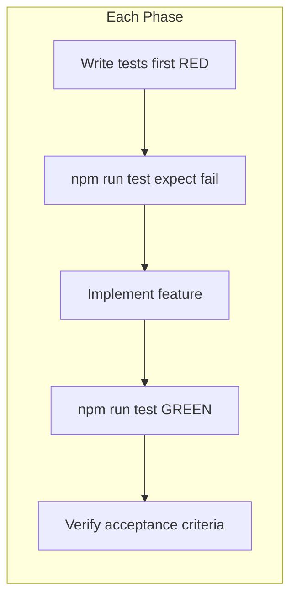
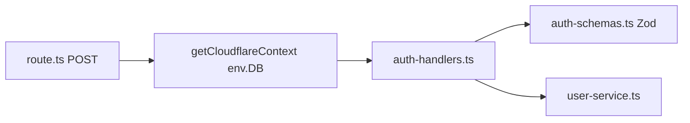
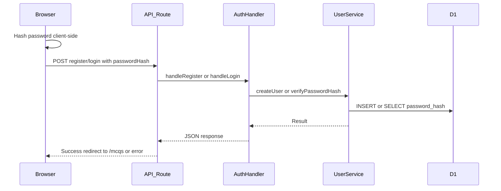

Date created: Aug 25, 2026

Date last modified: Aug 26, 2026 (Phases 1–4 implementation record)


# Register, Login, and Logout - Technical PRD


## Implementation Status Summary


| Item | Status |

|------|--------|

| Phases 1–4 | **COMPLETED and verified** |

| Phase 5 | **PLANNED** (Workers `npm run preview` smoke test) |

| Branch | `feature/auth-phase-1` |

| Test suite | 8 files, **43 tests** — all passing (Aug 26, 2026) |

| Manual verification | User confirmed register → `/mcqs` → login → logout via `npm run dev` (Aug 26, 2026) |


**Git commits (traceability):**


| Phase | Commit | Message |

|-------|--------|---------|

| 1 | `35a3883` | Vitest harness, D1 users migration, and PRD |

| 1 fix | `80ed001` | Fix deploy build by removing invalid Vitest `minWorkers` option |

| 2 | `0ebd878` | Add Phase 2 user service with TDD unit tests |

| 3 | `c15ecb3` | Add Phase 3 auth API routes with Zod validation and handler tests |

| 4 | *(local, uncommitted)* | UI pages, hash utility, component tests |


---


## Overview/Problem


We are building a greenfield Quiz Maker application where multiple teachers collaborate to create a shared test bank of multiple-choice questions. Before teachers can contribute questions, the application needs a way for each teacher to create an account and sign in. Without user registration and authentication, there is no way to identify who created or owns content, and multiple teachers cannot safely share the same application.


This PRD defines the **register/login/logout auth feature**, implemented in five phases. **Phases 1–4 are complete.** MCQ creation and collaboration features remain deferred to a later sprint.


---


## Hypothesis


We believe that providing basic username/password registration and login will enable multiple teachers to access the Quiz Maker and prepare the foundation for collaborative MCQ test bank creation in a future sprint.


---


## Scope


### In Scope


What will be built in this feature:


- Cloudflare D1 `users` table with a migration

- User service in `src/lib/` providing create, read, update, and delete operations for users

- HTTP POST API endpoints for register, login, and logout under `src/app/api/auth/`

- Password hashing at rest in the database (never store plaintext passwords)

- Client-side password hashing before transmission over HTTP POST on register and login

- Register page (`/register`), login page (`/login`), and MCQ stub page (`/mcqs`) as the post-auth destination

- Logout action that clears client-side state and redirects to the login page

- Vitest unit tests written test-first in every implementation phase (red → green)


### Out of Scope


What is explicitly not being built now but may be considered later:


- Social / OAuth login (Google, GitHub, etc.)

- JWT or other auth tokens

- Cookies or server-side session management

- MCQ CRUD, collaboration, or test-bank features

- Password reset or email verification

- Role-based access control (admin vs teacher)


### Cut


Things that were considered during planning but deliberately removed (and why):


- Session-based auth (cookies, server sessions) - Cut because Phase 1 is intentionally stateless and simple; sessions will be added in a future phase if needed

- Plaintext password storage - Cut for basic security; only hashed values are stored

- Server Actions as the primary mutation path - Cut in favor of explicit REST-style POST endpoints per this phase's spec (project rules generally prefer Server Actions; endpoints are the chosen approach here)

- bcrypt via native Node modules - Cut because Workers runtime constraints favor Web Crypto or a small Workers-compatible library; propose dependency before adding


---


## Technical Requirements


### Database Schema


The application uses Cloudflare D1 (SQLite). A single `users` table stores teacher accounts.


**Setup steps** (see `.cursor/rules/d1.mdc`):


1. Create the database: `npx wrangler d1 create quizmaker-db`

2. Add the `d1_databases` block to `wrangler.jsonc` with binding `DB`

3. Run `npm run cf-typegen` to type `env.DB`

4. Create migrations with `npx wrangler d1 migrations create quizmaker-db <description>`

5. Apply locally only: `npx wrangler d1 migrations apply quizmaker-db --local`


```sql

CREATE TABLE users (

  id TEXT PRIMARY KEY DEFAULT (lower(hex(randomblob(16)))),

  first_name TEXT NOT NULL,

  last_name TEXT NOT NULL,

  username TEXT NOT NULL UNIQUE,

  email TEXT NOT NULL UNIQUE,

  password_hash TEXT NOT NULL,

  created_at DATETIME DEFAULT CURRENT_TIMESTAMP

);


CREATE INDEX idx_users_username ON users (username);

CREATE INDEX idx_users_email ON users (email);

```


**Column notes:**


| Column | Description |

|--------|-------------|

| `id` | Primary key; auto-generated UUID-like string |

| `first_name` | Teacher's first name |

| `last_name` | Teacher's last name |

| `username` | Unique login identifier; may equal email |

| `email` | Unique email address; may equal username |

| `password_hash` | Hashed password value; never plaintext |

| `created_at` | Record creation timestamp |


### API Endpoints


All endpoints are route handlers under `src/app/api/auth/`. Request bodies are validated with Zod before use. Handler logic lives in `src/lib/services/auth-handlers.ts`; route files delegate to handlers after obtaining `env.DB` via `getCloudflareContext()`. The user service (`src/lib/services/user-service.ts`) handles all D1 access.


#### POST /api/auth/register


Creates a new user account.


**Request Body:**


```json

{

  "firstName": "Jane",

  "lastName": "Smith",

  "username": "jsmith",

  "email": "jsmith@school.edu",

  "passwordHash": "client-hashed-password-value"

}

```


**Validation rules:**


- `firstName`: required, non-empty string

- `lastName`: required, non-empty string

- `username`: required, non-empty string, unique in database

- `email`: required, valid email format, unique in database

- `passwordHash`: required, non-empty string (already hashed on client)

- Plaintext `password` field rejected by Zod `.strict()` schema


**Response:**


- Success (201): `{ "success": true, "userId": "<id>", "redirectUrl": "/mcqs" }`

- Error (400): Validation error — `{ "success": false, "error": "Validation failed", "details": [...] }`

- Error (409): Duplicate username or email — `{ "success": false, "error": "Username or email already exists" }`

- Error (500): Server error — `{ "success": false, "error": "Internal server error" }`


#### POST /api/auth/login


Verifies user credentials and returns success for redirect.


**Request Body:**


```json

{

  "usernameOrEmail": "jsmith",

  "passwordHash": "client-hashed-password-value"

}

```


**Validation rules:**


- `usernameOrEmail`: required, non-empty string (matches username or email)

- `passwordHash`: required, non-empty string (already hashed on client)

- Plaintext `password` field rejected by Zod `.strict()` schema


**Response:**


- Success (200): `{ "success": true, "userId": "<id>", "redirectUrl": "/mcqs" }`

- Error (400): Validation error — `{ "success": false, "error": "Validation failed", "details": [...] }`

- Error (401): Invalid credentials — `{ "success": false, "error": "Invalid username or password" }`

- Error (500): Server error — `{ "success": false, "error": "Internal server error" }`


**Login logic:** Look up user by username or email. Compare submitted `passwordHash` to stored `password_hash` using a constant-time comparison.


#### POST /api/auth/logout


Handles logout. Because Phase 1 has no server-side sessions or tokens, this endpoint acknowledges logout and instructs the client to clear local state.


**Request Body:** none required


**Response:**


- Success (200): `{ "success": true, "redirectUrl": "/login" }`


**Client behavior:** Clear any client-side auth state (e.g. `localStorage` user reference if stored), then redirect to `/login`.


### User Interface Requirements


Use existing shadcn/ui components: `field`, `input`, `button`, `card` from `src/components/ui/`.


**Layout baseline:** shadcn register and login blocks, adapted into reusable client components:


| Component | File | Notes |

|-----------|------|-------|

| Register form | `src/components/register-form.tsx` | Split full name → first + last; added username; kept confirm password (client-only); removed Google OAuth |

| Login form | `src/components/login-form.tsx` | Username or email (not email-only); removed forgot password and Google OAuth |

| Logout button | `src/components/logout-button.tsx` | POST logout, clear `localStorage`, redirect `/login` |


Page shells (`src/app/register/page.tsx`, `src/app/login/page.tsx`) center the form in a full-viewport layout. Navigation links use Next.js `Link` to `/login` and `/register`.


#### Register Page (`/register`)


- Form fields: first name, last name, username, email, password

- Client-side validation: all fields required; email must be valid format; password minimum length (8 characters)

- On submit: hash password client-side, POST to `/api/auth/register` with hash (not plaintext)

- On success: redirect to `/mcqs`

- On error: display error message via `FieldError`

- Link to login page for existing users


#### Login Page (`/login`)


- Form fields: username or email, password

- Client-side validation: both fields required

- On submit: hash password client-side, POST to `/api/auth/login` with hash (not plaintext)

- On success: redirect to `/mcqs`

- On error: display generic "Invalid username or password" message (do not reveal whether username exists)

- Link to register page for new users


#### MCQ Stub Page (`/mcqs`)


- Placeholder page for Sprint 2 MCQ features

- Display a heading such as "MCQ Test Bank" and brief stub text indicating this area will be built next

- Include a logout button/link that POSTs to `/api/auth/logout` and redirects to `/login`

- Optionally store minimal client-side user reference (e.g. userId in `localStorage`) after login/register for display purposes only — not for security


#### Home Page (`/`)


- Redirects unauthenticated visitors to `/login` via server-side `redirect()` in `src/app/page.tsx`


---


## Testing Strategy


This feature is implemented using **test-driven development (TDD)** with **Vitest** as the unit testing framework. Conventions follow [`.cursor/skills/testing/SKILL.md`](.cursor/skills/testing/SKILL.md).


### Framework and Setup (Installed)


| Item | Location |

|------|----------|

| Scripts | `package.json` — `"test"`, `"test:watch"` |

| Config | `vitest.config.ts` — `jsdom`, `maxWorkers: 1`, `setupFiles` |

| Matchers | `vitest.setup.ts` — `@testing-library/jest-dom/vitest` |


**Dev dependencies installed:**


`vitest`, `@vitejs/plugin-react`, `@testing-library/react`, `@testing-library/dom`, `@testing-library/jest-dom`, `@testing-library/user-event`, `jsdom`, `vite-tsconfig-paths`


### Test Inventory


| File | Phase | Tests |

|------|-------|-------|

| `migrations/0001_create_users.test.ts` | 1 | 2 |

| `src/lib/__test__/setup.test.ts` | 1 | 1 |

| `src/lib/services/user-service.test.ts` | 2 | 18 |

| `src/lib/services/auth-handlers.test.ts` | 3 | 11 |

| `src/lib/auth/hash-password.test.ts` | 4 | 3 |

| `src/app/register/register-form.test.tsx` | 4 | 4 |

| `src/app/login/login-form.test.tsx` | 4 | 3 |

| `src/app/mcqs/logout-button.test.tsx` | 4 | 1 |

| **Total** | | **43** |


### TDD Workflow (Every Phase)


Each implementation phase follows **Red → Green → Refactor**:


1. **RED** — Write tests for the phase's behavior before implementation; run `npm run test` and confirm they fail

2. **GREEN** — Implement the minimum code to make tests pass

3. **Refactor** — Clean up while keeping tests green

4. **Verify** — Confirm phase exit criteria and relevant acceptance criteria





### Conventions


- **Colocation**: Tests live beside source — `user-service.ts` tested by `user-service.test.ts`

- **Mocking**: Mock at module boundaries; never hit real D1, network, or external services in unit tests

- **Cloudflare bindings**: Mock `getCloudflareContext()` and supply a fake `env.DB` (see testing skill)

- **React**: Use `@testing-library/react` and `userEvent`; test client components only — extract Server Component logic into testable functions

- **Handler extraction**: Auth route logic tested via `auth-handlers.test.ts`, not per-route test files

- **Quality**: Assert observable behavior and failure paths; no hollow tests like `expect(true).toBe(true)`

- **Phase completion signal**: `npm run test` passes for that phase's tests plus listed acceptance criteria


### Test Scripts


| Command | Purpose |

|---------|---------|

| `npm run test` | Run full suite once (CI and phase exit check) |

| `npm run test:watch` | Watch mode for local TDD |


---


## Implementation Phases


### Phase 1: D1 Setup, Migration, and Test Harness - COMPLETED


**Objective**: Set up the Vitest test harness, create the D1 database, configure the binding, and apply the `users` table migration locally.


**TDD approach**: Write migration schema tests and a harness smoke test first (RED). Create the migration file and Vitest config to turn tests GREEN. Phase 1 does not integration-test real D1 — it validates migration SQL structure and establishes the test foundation for later phases.


**Tests first (RED)**:


| Test file | What it asserts |

|-----------|-----------------|

| `migrations/0001_create_users.test.ts` | Migration SQL defines `users` table with columns `id`, `first_name`, `last_name`, `username`, `email`, `password_hash`, `created_at` and indexes on `username`/`email` |

| `src/lib/__test__/setup.test.ts` | Vitest harness loads and runs (smoke test once config is wired) |


**Tasks**:


1. Install Vitest dev dependencies; add `vitest.config.ts` and `test` / `test:watch` scripts (per testing skill)

2. Write migration schema tests and harness smoke test (RED — confirm `npm run test` fails)

3. Run `npx wrangler d1 create quizmaker-db`

4. Add `d1_databases` block to `wrangler.jsonc` with binding `DB`

5. Run `npm run cf-typegen`

6. Create migration for `users` table matching test expectations

7. Apply migration locally: `npx wrangler d1 migrations apply quizmaker-db --local`

8. Confirm migration and harness tests turn GREEN


**Deliverables**:


- `vitest.config.ts` and `package.json` test scripts

- `migrations/0001_create_users.test.ts` and `src/lib/__test__/setup.test.ts`

- `wrangler.jsonc` updated with D1 binding

- `migrations/0001_create_users.sql`

- Typed `env.DB` in `cloudflare-env.d.ts`


**Implementation Record**:


- **Migration**: `migrations/0001_create_users.sql:3-14` — `users` table + indexes on `username` and `email`

- **D1 binding**: `wrangler.jsonc:21-28` — binding `DB`, database `quizmaker-db`, `migrations_dir: "migrations"`

- **Vitest config**: `vitest.config.ts:7-13` — `jsdom`, `globals`, `maxWorkers: 1`, `setupFiles`

- **Tests**: `migrations/0001_create_users.test.ts` (2 tests), `src/lib/__test__/setup.test.ts` (1 test)

- **Git commit**: `35a3883` (fix: `80ed001` — removed invalid `minWorkers`)


**Verification**: Migration applied locally; harness tests green.


**Phase exit criteria**:


- `npm run test` passes for Phase 1 test files

- Migration applied locally

- D1 binding configured in `wrangler.jsonc`


### Phase 2: User Service - COMPLETED


**Objective**: Implement the user service with CRUD operations and password comparison.


**TDD approach**: Write all user service tests against a mocked D1 binding first (RED). Implement `user-service.ts` until tests pass (GREEN).


**Tests first (RED)** — `src/lib/services/user-service.test.ts`:


- `createUser` inserts and returns user with generated id

- `createUser` rejects duplicate username

- `createUser` rejects duplicate email

- `getUserByUsername` returns user or null

- `getUserByEmail` returns user or null

- `getUserById` returns user or null

- `getUserByUsernameOrEmail` finds user by username or email

- `updateUser` persists changes

- `deleteUser` removes record

- `verifyPasswordHash` returns true on match, false on mismatch (constant-time comparison)

- All D1 access mocked — no real database


**Tasks**:


1. Write `user-service.test.ts` with mocked D1 (RED)

2. Create `src/lib/services/user-service.ts`

3. Implement `createUser`, `getUserByUsername`, `getUserByEmail`, `getUserById`, `getUserByUsernameOrEmail`, `updateUser`, `deleteUser`

4. Implement `verifyPasswordHash` for login comparison

5. Use prepared statements with numbered placeholders (`?1`, `?2`)

6. Confirm all user service tests turn GREEN


**Deliverables**:


- `src/lib/services/user-service.test.ts` (18 tests passing)

- `src/lib/services/user-service.ts` with full CRUD and login verification


**Implementation Record**:


- **Service**: `src/lib/services/user-service.ts`

  - Duplicate errors: `DuplicateUsernameError`, `DuplicateEmailError` — `user-service.ts:28-40`

  - Lookup: `getUserByUsernameOrEmail` — `user-service.ts:67-77`

  - Create: `createUser` — `user-service.ts:79-103`

  - Update/delete: `updateUser` — `user-service.ts:105-143`; `deleteUser` — `user-service.ts:145-148`

  - Password compare: `verifyPasswordHash` using `timingSafeEqual` — `user-service.ts:150-159`

- **Tests**: `src/lib/services/user-service.test.ts` — **18 tests**

- **Git commit**: `0ebd878`


**Verification**: All CRUD and hash-comparison paths covered with mocked D1.


**Phase exit criteria**:


- `npm run test` passes for user service tests

- Acceptance: user service provides create, read, update, and delete operations


### Phase 3: API Routes - COMPLETED


**Objective**: Implement register, login, and logout endpoints with Zod validation.


**TDD approach**: Write handler tests with mocked user service first (RED). Add `zod` and implement handlers + thin route wrappers until tests pass (GREEN). Handler logic extracted to `auth-handlers.ts` to avoid Next.js request plumbing in tests.


**Architecture**:





**Tests first (RED)** — `src/lib/services/auth-handlers.test.ts` (11 tests):


| Handler | Cases |

|---------|-------|

| `handleRegister` | 201 on valid body; 400 on validation failure; 409 on duplicate username/email; passes `passwordHash` not plaintext; rejects body with plaintext `password` field |

| `handleLogin` | 200 on valid credentials; 401 on wrong password; 401 on unknown user; 400 on invalid body |

| `handleLogout` | 200 with `{ redirectUrl: "/login" }` |


Route files are thin wrappers; tests target handlers directly with mocked `user-service`.


**Tasks**:


1. Write handler tests (RED)

2. Add `zod` dependency

3. Create Zod schemas in `src/lib/validators/auth-schemas.ts`

4. Create `src/lib/services/auth-handlers.ts` with `handleRegister`, `handleLogin`, `handleLogout`

5. Create thin route wrappers under `src/app/api/auth/`

6. Confirm all handler tests turn GREEN


**Deliverables**:


- `src/lib/validators/auth-schemas.ts`

- `src/lib/services/auth-handlers.ts`

- `src/lib/services/auth-handlers.test.ts` (11 tests)

- Three route handlers: `src/app/api/auth/register/route.ts`, `login/route.ts`, `logout/route.ts`


**Implementation Record**:


- **Zod schemas**: `src/lib/validators/auth-schemas.ts:8-27` — `.strict()` + plaintext `password` rejection via `rejectPlaintextPassword`

- **Handlers**: `src/lib/services/auth-handlers.ts`

  - `handleRegister` — `auth-handlers.ts:22-57` (201 / 400 / 409 / 500)

  - `handleLogin` — `auth-handlers.ts:59-91` (200 / 401 / 400)

  - `handleLogout` — `auth-handlers.ts:93-98` (200 + `redirectUrl: "/login"`)

- **Route delegation**: `src/app/api/auth/register/route.ts:4-8` — `getCloudflareContext()` → `handleRegister(env.DB, body)`

- **Tests**: `src/lib/services/auth-handlers.test.ts` — **11 tests**

- **Git commit**: `c15ecb3`


**Verification**: Handler tests green; routes wired via `getCloudflareContext()`.


**Phase exit criteria**:


- `npm run test` passes for all auth handler tests

- Acceptance: all API endpoints validate input with Zod; registration rejects duplicates; login rejects invalid credentials


### Phase 4: UI Pages and Client Hashing - COMPLETED


**Objective**: Build register, login, and MCQ stub pages with client-side password hashing.


**TDD approach**: Write tests for the hash utility and client form components first (RED). Implement pages and wire to API endpoints until tests pass (GREEN).


**Tests first (RED)**:


| Test file | Cases |

|-----------|-------|

| `src/lib/auth/hash-password.test.ts` | Same input produces same hash; different inputs produce different hashes; output is hex string |

| `src/app/register/register-form.test.tsx` | Renders PRD fields; submits hashed password (mock `fetch`); confirm-password mismatch blocks submit; shows API error on 409 |

| `src/app/login/login-form.test.tsx` | Renders fields; submits hashed password; shows generic error on 401 |

| `src/app/mcqs/logout-button.test.tsx` | Logout POST called; clears `localStorage`; redirects to `/login` |


Use `@testing-library/react`, `@testing-library/dom`, `@testing-library/jest-dom`, and `userEvent`. Test client components only.


**Tasks**:


1. Write hash utility and component tests (RED)

2. Create shared client-side password hashing utility (`src/lib/auth/hash-password.ts`)

3. Create `RegisterForm` client component and `src/app/register/page.tsx`

4. Create `LoginForm` client component and `src/app/login/page.tsx`

5. Create MCQ stub page with `LogoutButton` at `src/app/mcqs/page.tsx`

6. Update home page with navigation to register/login

7. Confirm all UI tests turn GREEN


**Deliverables**:


- `src/lib/auth/hash-password.ts` and `hash-password.test.ts`

- `src/components/register-form.tsx`, `login-form.tsx`, `logout-button.tsx`

- `src/app/register/register-form.test.tsx`

- `src/app/login/login-form.test.tsx`

- `src/app/mcqs/logout-button.test.tsx`

- Register, login, and MCQ stub pages wired to API endpoints

- `vitest.setup.ts` with `@testing-library/jest-dom/vitest` matchers


**Implementation Record**:


- **Hash utility**: `src/lib/auth/hash-password.ts:1-7` — SHA-256 hex via Web Crypto

- **RegisterForm**: `src/components/register-form.tsx:54-82` — hashes password, POSTs `passwordHash` only, stores `userId` in `localStorage`, redirects `/mcqs`

- **LoginForm**: `src/components/login-form.tsx:43-65` — POSTs hashed credentials; generic error on failure

- **LogoutButton**: `src/components/logout-button.tsx:11-17` — POST logout, `localStorage.removeItem("userId")`, redirect `/login`

- **Pages**: `src/app/register/page.tsx`, `src/app/login/page.tsx`, `src/app/mcqs/page.tsx:8-14`, `src/app/page.tsx`

- **Test setup**: `vitest.setup.ts` — `@testing-library/jest-dom/vitest`

- **Tests**: 11 Phase 4 tests (3 + 4 + 3 + 1)

- **Git commit**: *(local, uncommitted on `feature/auth-phase-1`)*


**Verification**:


- Automated: 43/43 tests, lint, build pass (Aug 26, 2026)

- **Manual (user-verified)**: Navigate to `/login`, register new user, log in with credentials, log out successfully via `npm run dev` locally (Aug 26, 2026)


**Phase exit criteria**:


- `npm run test` passes for hash utility and component tests (43 tests total)

- `npm run lint` and `npm run build` pass

- Acceptance: passwords hashed client-side before POST; successful register/login redirect to `/mcqs`; logout redirects to `/login`


### Phase 5: Verification - PLANNED


**Objective**: Confirm the full test suite passes and the feature works end-to-end on the Workers runtime.


**TDD approach**: No new tests — run the complete suite and manual smoke tests to validate integration beyond unit test mocks.


**Tasks**:


1. Run `npm run test` — full suite must pass *(done — 43/43)*

2. Run `npm run lint` *(done)*

3. Run `npm run build` *(done)*

4. Run `npm run preview` and manually test register, login, logout, and redirect flows

5. Update PRD Current Status and mark acceptance criteria complete


**Deliverables**:


- Full test suite green (`npm run test`)

- Lint and build pass

- Manual smoke test documented in Current Status


**Phase exit criteria**:


- `npm run test`, `npm run lint`, and `npm run build` all pass

- Manual smoke test via `npm run preview` confirms redirect flows

- All acceptance criteria checked


---


## Technical Implementation Details


### Key Files


- `wrangler.jsonc` — D1 database binding configuration

- `migrations/0001_create_users.sql` — Users table schema

- `src/lib/services/user-service.ts` — User CRUD and password verification

- `src/lib/validators/auth-schemas.ts` — Zod schemas for register/login request bodies

- `src/lib/services/auth-handlers.ts` — `handleRegister`, `handleLogin`, `handleLogout`

- `src/lib/auth/hash-password.ts` — Shared password hashing utility (client and server compatible)

- `src/components/register-form.tsx` — Register form client component (shadcn block adapted)

- `src/components/login-form.tsx` — Login form client component (shadcn block adapted)

- `src/components/logout-button.tsx` — Logout action for MCQ stub page

- `src/app/api/auth/register/route.ts` — Registration endpoint wrapper

- `src/app/api/auth/login/route.ts` — Login endpoint wrapper

- `src/app/api/auth/logout/route.ts` — Logout endpoint wrapper

- `src/app/register/page.tsx` — Registration page shell

- `src/app/login/page.tsx` — Login page shell

- `src/app/mcqs/page.tsx` — MCQ stub page (post-auth destination)

- `src/app/page.tsx` — Home page redirect to `/login`


### Test Files


- `vitest.config.ts` — Vitest configuration at repo root

- `vitest.setup.ts` — Jest-DOM matchers for component tests

- `src/lib/__test__/setup.test.ts` — Harness smoke test (Phase 1)

- `migrations/0001_create_users.test.ts` — Migration schema validation (Phase 1)

- `src/lib/services/user-service.test.ts` — User service CRUD and password verification (Phase 2)

- `src/lib/services/auth-handlers.test.ts` — Auth handler logic (Phase 3)

- `src/lib/auth/hash-password.test.ts` — Client-side hashing utility (Phase 4)

- `src/app/register/register-form.test.tsx` — Registration form component (Phase 4)

- `src/app/login/login-form.test.tsx` — Login form component (Phase 4)

- `src/app/mcqs/logout-button.test.tsx` — Logout button component (Phase 4)


Handler logic is tested via `auth-handlers.test.ts`; route files delegate to handlers and are not tested separately.


### Code Reference Index


| Concept | Location |

|---------|----------|

| Users table schema | `migrations/0001_create_users.sql:3-14` |

| D1 binding `DB` | `wrangler.jsonc:21-28` |

| User lookup by username or email | `user-service.ts:67-77` |

| User creation with duplicate checks | `user-service.ts:79-103` |

| Constant-time password compare | `user-service.ts:150-159` |

| Zod register schema (`.strict()`) | `auth-schemas.ts:8-18` |

| Zod plaintext password rejection | `auth-schemas.ts:3-6` |

| Register handler | `auth-handlers.ts:22-57` |

| Login handler | `auth-handlers.ts:59-91` |

| Logout handler | `auth-handlers.ts:93-98` |

| Route → handler delegation | `register/route.ts:4-8` |

| Client SHA-256 hash | `hash-password.ts:1-7` |

| Register form submit flow | `register-form.tsx:54-82` |

| Login form submit flow | `login-form.tsx:43-65` |

| Logout client flow | `logout-button.tsx:11-17` |

| MCQ stub page | `mcqs/page.tsx:8-14` |


### Password Handling Flow





**Register flow:**


1. User enters password on register form

2. Client hashes password using Web Crypto SHA-256 — `hash-password.ts:1-7`

3. POST `/api/auth/register` with `passwordHash` and user fields — `register-form.tsx:54-65`

4. Handler validates with Zod, user service stores hash in `password_hash` — `auth-handlers.ts:22-37`, `user-service.ts:88-94`

5. Client stores `userId` in `localStorage`, redirects to `/mcqs` — `register-form.tsx:78-82`


**Login flow:**


1. User enters password on login form

2. Client hashes password using the same algorithm as registration — `hash-password.ts:1-7`

3. POST `/api/auth/login` with `usernameOrEmail` and `passwordHash` — `login-form.tsx:43-48`

4. User service looks up user and compares hashes with constant-time comparison — `auth-handlers.ts:66-67`, `user-service.ts:150-159`

5. On match, client redirects to `/mcqs` — `login-form.tsx:65`


**Logout flow:**


1. User clicks logout on MCQ stub page

2. POST `/api/auth/logout` — `logout-button.tsx:15`

3. Client clears `localStorage.userId` — `logout-button.tsx:16`

4. Client redirects to `/login` — `logout-button.tsx:17`


### Implementation Patterns


From `user-service.ts:67-77`:


```typescript

export async function getUserByUsernameOrEmail(

  db: D1Database,

  usernameOrEmail: string,

): Promise<User | null> {

  const result = await db

    .prepare("SELECT * FROM users WHERE username = ?1 OR email = ?1")

    .bind(usernameOrEmail)

    .all<User>();

  return firstResult(result.results);

}

```


From `hash-password.ts:1-7`:


```typescript

export async function hashPassword(password: string): Promise<string> {

  const encoder = new TextEncoder();

  const data = encoder.encode(password);

  const hashBuffer = await crypto.subtle.digest("SHA-256", data);

  const hashArray = Array.from(new Uint8Array(hashBuffer));

  return hashArray.map((byte) => byte.toString(16).padStart(2, "0")).join("");

}

```


From `auth-schemas.ts:8-18`:


```typescript

export const registerSchema = rejectPlaintextPassword(

  z

    .object({

      firstName: z.string().min(1),

      lastName: z.string().min(1),

      username: z.string().min(1),

      email: z.string().email(),

      passwordHash: z.string().min(1),

    })

    .strict(),

);

```


From `register/route.ts:4-8`:


```typescript

export async function POST(request: Request) {

  const { env } = await getCloudflareContext();

  const body = await request.json();

  return handleRegister(env.DB, body);

}

```


### Important Notes


- D1 is only reachable from server code; never import the user service into `'use client'` components

- Always use prepared statements with bound parameters; never concatenate user input into SQL

- Prefer `all()` over `first()` for D1 queries (local vs remote consistency)

- Apply migrations locally only; never run `migrations apply --remote` without explicit user approval

- Client-side hashing reduces plaintext password exposure over the wire but is not a substitute for HTTPS in production

- No persistent server-side auth; the MCQ stub page is not protected by middleware in this phase

- Follow TDD: write tests first in each phase; a phase is incomplete until `npm run test` passes for its tests

- Propose only **new** dependencies going forward; Vitest stack and `zod` are already installed


---


## Verification Record


Verified as of Aug 26, 2026:


| Check | Result | Notes |

|-------|--------|-------|

| `npm run test` | Pass — 43/43 | Aug 26, 2026 |

| `npm run lint` | Pass | Aug 26, 2026 |

| `npm run build` | Pass | Routes: `/`, `/login`, `/register`, `/mcqs`, `/api/auth/*` |

| Manual register/login/logout | Pass | User verified via `npm run dev` locally — register, login with credentials, logout |

| `npm run preview` (Workers) | Not yet run | Phase 5 remaining |


---


## Acceptance Criteria


- [x] Vitest harness configured (`vitest.config.ts`, `npm run test` works)

- [x] Each phase's unit tests pass (`npm run test` green before moving to the next phase)

- [x] Tests cover happy paths and failure paths (validation, duplicates, invalid credentials)

- [x] A teacher can register with first name, last name, username, email, and password

- [x] Registration rejects duplicate usernames with a clear error

- [x] Registration rejects duplicate emails with a clear error

- [x] Passwords are hashed client-side before HTTP POST on register and login

- [x] Only hashed passwords are stored in the database; plaintext is never persisted

- [x] A teacher can log in with username or email plus password

- [x] Login rejects invalid credentials with a generic error message

- [x] Successful registration redirects to `/mcqs`

- [x] Successful login redirects to `/mcqs`

- [x] MCQ stub page displays placeholder content for Sprint 2

- [x] Logout clears client-side state and redirects to `/login`

- [x] User service provides create, read, update, and delete operations

- [x] All API endpoints validate input with Zod

- [x] `npm run lint`, `npm run build`, and `npm run test` pass


---


## Success Metrics


| Metric | Target | Result |

|--------|--------|--------|

| Unit test pass rate | 100% before each phase is marked complete | **100%** — 43/43 tests pass (Aug 26, 2026) |

| Registration success rate | 100% for valid unique inputs during testing | **Verified** — user registered successfully via local dev |

| Login success rate | 100% for registered users with correct password | **Verified** — user logged in with registered credentials |

| Password security | 0 plaintext passwords in DB or request logs | **Verified by design** — client sends `passwordHash`; Zod `.strict()` rejects plaintext; handler tests assert no plaintext in `createUser` calls |

| Redirect correctness | 100% redirect to `/mcqs` after register/login | **Verified** — user confirmed register and login redirect to `/mcqs` |

| Logout correctness | 100% redirect to `/login` after logout | **Verified** — user confirmed logout redirect to `/login` |

| Workers preview smoke test | End-to-end on Workers runtime | **Pending Phase 5** — `npm run preview` not yet run |


---


## Dependencies


### External Dependencies


- Cloudflare D1 — SQLite database for user storage

- Web Crypto API — Client-side password hashing (built into browsers and Workers)


### Internal Dependencies


- `@opennextjs/cloudflare` / `getCloudflareContext()` — Access D1 binding from route handlers

- `src/lib/services/user-service.ts` — Centralized user data access

- `src/lib/validators/auth-schemas.ts` — Request body validation

- `src/lib/services/auth-handlers.ts` — Auth handler logic

- shadcn/ui components (`field`, `input`, `button`, `card`) — Form UI


### Installed Dependencies


**Production:**


- `zod` — Request body validation in API route handlers


**Dev (test harness):**


- `vitest`, `@vitejs/plugin-react`, `@testing-library/react`, `@testing-library/dom`, `@testing-library/jest-dom`, `@testing-library/user-event`, `jsdom`, `vite-tsconfig-paths`


### Environment Variables


- None required for Phase 1 (no secrets for basic auth without sessions)


---


## Risks and Mitigation


### Technical Risks


- **Risk**: No session management means no server-enforced auth on `/mcqs`; any user can navigate there directly

- **Mitigation**: Accept as Phase 1 limitation; document that route protection will be added when sessions are introduced in a future phase


- **Risk**: Client-side SHA-256 alone is weaker than server-side salted hashing (bcrypt/argon2)

- **Mitigation**: Accept for Phase 1 baseline; plan to add server-side salting or upgrade hashing algorithm in a future security pass


- **Risk**: D1 binding misconfiguration causes runtime errors on Workers

- **Mitigation**: Verify with `npm run preview` (Workers runtime) not just `npm run dev` (Node runtime)


- **Risk**: Unit tests mock D1 but real Workers runtime behaves differently

- **Mitigation**: Phase 5 manual smoke test via `npm run preview` complements unit tests; raise `@cloudflare/vitest-pool-workers` with user if Workers-runtime integration tests are needed later


### User Experience Risks


- **Risk**: Users expect to stay logged in across browser sessions but Phase 1 has no persistence

- **Mitigation**: Document limitation; add session/cookie auth in a future phase


- **Risk**: Duplicate username/email errors may confuse users during registration

- **Mitigation**: Return specific, actionable error messages for 409 conflicts


---


## Troubleshooting Guide


Issues discovered and resolved during Phases 1–4:


1. **Vitest worker timeouts on Windows**

   - Symptom: Tests hang or fail with `Timeout waiting for worker to respond`

   - Fix: Set `maxWorkers: 1` in `vitest.config.ts:11`


2. **Deploy build failure: invalid `minWorkers` option**

   - Symptom: `next build` fails due to invalid Vitest config

   - Fix: Removed `minWorkers` from `vitest.config.ts` (commit `80ed001`)


3. **Component tests: `Cannot find module '@testing-library/dom'`**

   - Symptom: `register-form.test.tsx`, `login-form.test.tsx`, `logout-button.test.tsx` fail to load

   - Fix: Added `@testing-library/dom` and `@testing-library/jest-dom` dev dependencies; added `vitest.setup.ts` with `@testing-library/jest-dom/vitest`; registered via `setupFiles` in `vitest.config.ts:10`


4. **Home page `Button asChild` not supported**

   - Symptom: Base UI Button lacks Radix-style `asChild` prop

   - Fix: Replaced landing page with `redirect("/login")` in `src/app/page.tsx` (default entry is login)


5. **Auth schema must reject plaintext `password` field**

   - Symptom: Register handler test for plaintext rejection failed

   - Fix: Added `.strict()` and `rejectPlaintextPassword` refine in `auth-schemas.ts:3-18`


6. **UX terminology and default route (Aug 26, 2026)**

   - Change: `/` redirects to `/login`; "Sign up" renamed to "Register"; `SignupForm` renamed to `RegisterForm` (`register-form.tsx`)

   - Wrangler: added `migrations_dir: "migrations"` to D1 binding in `wrangler.jsonc`


---


## Notes for AI Agents


When working with this PRD:


1. Start by reading the Overview and Hypothesis to understand intent

2. Use Scope (In/Out/Cut) to determine boundaries — do not build MCQ features, social login, tokens, or session management

3. **Follow TDD in every phase**: write tests first (RED), implement until green (GREEN), then refactor

4. Never skip writing tests at the start of a phase; confirm tests fail before implementing

5. Follow [`.cursor/skills/testing/SKILL.md`](.cursor/skills/testing/SKILL.md) for setup, mocking, and assertion quality

6. A phase is not complete until its tests pass and its acceptance criteria are satisfied

7. Update phase status markers as work progresses

8. Add implementation details under "Technical Implementation Details" as code is written

9. Phases 1–4 acceptance criteria are checked; troubleshooting section is populated

10. Add troubleshooting entries when bugs are found and fixed

11. Keep all sections current — remove outdated information

12. Use code references format: `filepath:line-number` when citing code

13. Vitest stack and `zod` are installed; propose only **new** dependencies before adding them

14. Never apply D1 migrations to the remote database without explicit user approval


---


## Current Status


**Last Updated**: Aug 26, 2026

**Phases 1–4**: **COMPLETED and verified** (automated tests + user manual Phase 4 smoke test)

**Recent corrections**: Home (`/`) redirects to `/login`; signup terminology renamed to register; `migrations_dir` set on D1 binding

**Current Phase**: Phase 5 — Verification

**Status**: PLANNED

**Next Steps**: Run `npm run preview` Workers smoke test

